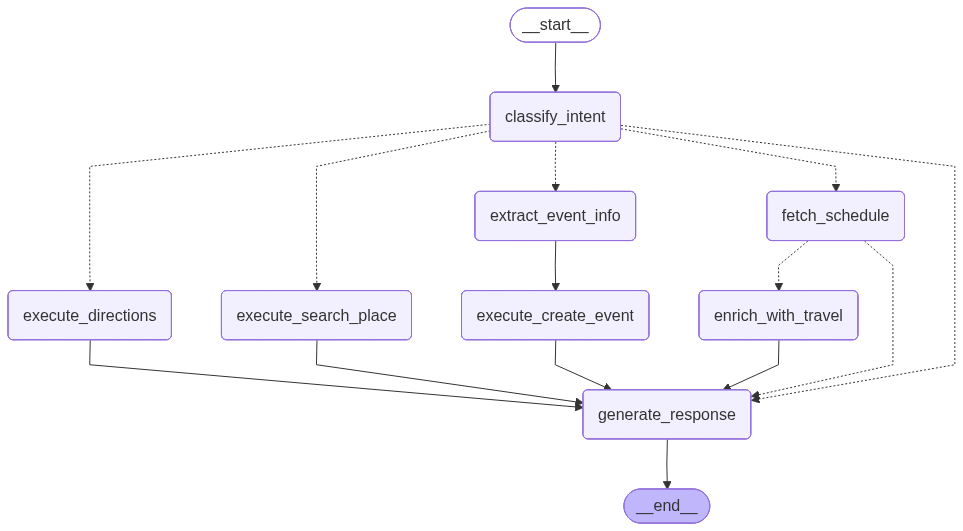

# Personal Assistant Agent

A modular Google services agent built with **LangGraph** and **FastMCP**.

## Architecture

```
                         ┌─────────────────┐
                    ┌───▶│ Calendar Server │───▶ Google Calendar
                    │    └─────────────────┘
┌──────────────┐    │    ┌─────────────────┐
│   LangGraph  │────┼───▶│  Gmail Server   │───▶ Gmail API
│    Agent     │  MCP    └─────────────────┘
└──────────────┘    │    ┌─────────────────┐
                    └───▶│  Maps Server    │───▶ Google Maps
                         └─────────────────┘
```

## Agent Workflow

The agent uses **Full Workflow** pattern (no ReAct loops) for predictable, controlled responses.



### Intents

| Intent | Description | Workflow |
|--------|-------------|----------|
| `check_schedule` | View events | fetch → enrich travel → response |
| `create_event` | Create new event | extract info → execute → response |
| `search_place` | Search places | search → response |
| `get_directions` | Get directions | directions → response |
| `general` | Other requests | response (no tools) |

### Features

- **Predictable flow**: Each intent follows a defined workflow
- **Auto travel info**: Schedule queries automatically include travel time from your default location
- **Human-in-the-loop**: Event creation requires user approval
- **Structured data**: Calendar returns JSON for reliable parsing

## Available Servers

| Server | Status | Tools |
|--------|--------|-------|
| 📅 Calendar | ✅ Ready | `get_events`, `create_event` |
| 📧 Gmail | 🚧 Template | `search_emails`, `send_email`, `get_unread_emails` |
| 🗺️ Maps | ✅ Ready | `search_places`, `get_directions`, `get_place_details` |

## Quick Start

### 1. Install

```bash
pip install -r requirements.txt
```

### 2. Google Calendar Setup

1. Go to [Google Cloud Console](https://console.cloud.google.com/)
2. Enable **Google Calendar API**
3. Create OAuth 2.0 credentials (Desktop App)
4. Download as `credentials.json`

### 3. Environment

```bash
export OPENAI_API_KEY=your-api-key
export GOOGLE_MAPS_API_KEY=your-maps-key
```

### 4. Run

```bash
python agent.py
```

## User Configuration

Edit `agent.py` to set your default location and transport:

```python
USER_CONFIG = {
    "default_location": "Redhill",  # Your home/office address
    "default_transport": "transit",       # transit, driving, walking, bicycling
    "buffer_minutes": 10,                 # Extra time before appointments
}
```

## Project Structure

```
langraph_mcp_agent/
├── agent.py                 # Main agent with Full Workflow
├── servers/
│   ├── gcalendar.py         # Google Calendar server
│   ├── gmail.py             # Gmail server (template)
│   └── maps.py              # Google Maps server
├── telegram_bot.py          # Telegram bot integration
├── oauth_server.py          # OAuth callback server
├── user_token_manager.py    # Multi-user token management
├── requirements.txt
└── README.md
```

## Usage Example

```
🤖 Multi-Service Agent

Connecting to servers...
  ✅ calendar: ['get_events', 'create_event']
  ✅ maps: ['search_places', 'get_directions', 'get_place_details']

📦 Total tools: 5
🔒 Approval required for: ['create_event', 'delete_event', 'update_event']

You: What is today's schedule?
Assistant: You have a dinner appointment at 8 PM at Botanic Garden.
It takes about 45 minutes by transit from Redhill.
Leave by 7:05 PM to arrive on time.

You: q
👋 Bye
```